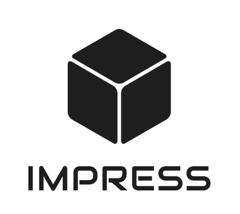

.. rst-class:: hide-header

IMPRESS, Intuitive Multilevel Preprocessor for Smart Simulation, is a preprocessor for general purpose capable of handling meshes 2D and 3D meshes. It uses the robustness of PyMoab allied to a simple interface to generate all required mesh entities in a simulation (multilevel or not) by receiving only coarsening parameters (if necessary) and a .msh or .h5m mesh file.

Documentation coming soon!

.. toctree::
   :maxdepth: 4
   :caption: Contents:

   tutorials

   examples

   packages

Indices and tables
==================

* :ref:`genindex`
* :ref:`modindex`
* :ref:`search`
