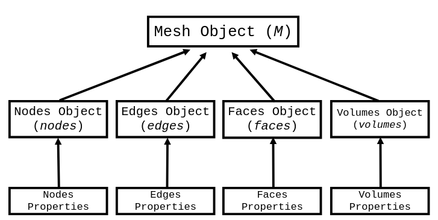

How to Access Mesh Entities Properties
======================================

To perform any kind of simulation, it will be necessary to access informations about the mesh entities such as coordinates from a node or from the center of an edge, for example. Probably, the user will also need informations about the adjacents elements or even the internal or boundary elements as well. We call these informations of **properties**.

IMPRESS was developed to automatically generated these properties for any kind of mesh entity (nodes, edges, faces or volumes, in a 3D mesh). Every time IMPRESS is executed, several objects are created to represent the mesh entities and inherited by a main class (that represents the mesh itself). A ilustrative image of the inheritance scheme follows below:

The IMPRESS' execution script instatiates this class creating an object called **M** through which it's possible to access all mesh entities. Furthermore, the user can obtain the mesh entity properties through its objects (which are literally called `nodes`, `edges`, `faces` and `volumes`).

Properties
----------
The **properties** that IMPRESS provides are described below:

* **Coordinates**: returns the coordinates of an array of elements;

* **Center**: returns the coordinates of the center of an array of elements;

* **Boundary Elements**: returns the global id from all elements located in the mesh boundaries;

* **Internal Elements**: returns the global id from all elements that do not belong to the mesh boundaries;

* **Adjacencies**: returns global id from all elements of the same dimension that are immediately connected to the element;

* **Connectivities**:

* **Flags**:

* **Flagged Elements**:

* **Global ID**: Every type of mesh entity receives during the preprocessing a global ID, ranging from 0 to n-1 elements from the specific entity type. It is useful to perform many vectorized operations and identify elements that may receive a especial boundary condition as well, for example. It is especially important when a multiscale simulation is being perfomed.

These informations are stores in python objects:

=================  ==================== ===== ======
Properties         Object               Input Output
=================  ==================== ===== ======
Coordinates        coords
Boundary Elements  boundary
Internal Elements  internal
Adjacencies        adjacencies
Connectivities     connectivies
Flags              all_flags
Flagged Elements   all_flagged_elements
Global ID          global_id
=================  ==================== ===== ======

Consulting Properties
---------------------

Coarse Scale Mesh Entities Properties
-------------------------------------

Coming soon!
